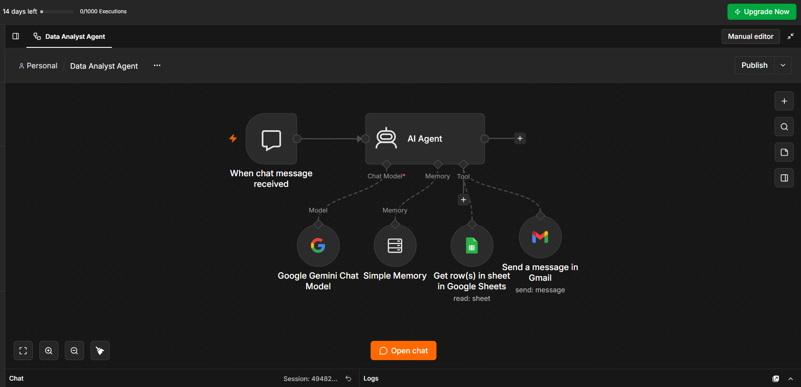
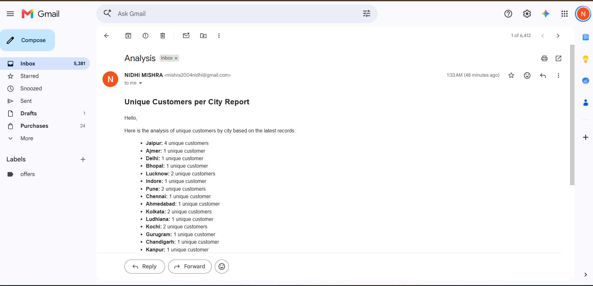

# AI-Powered Data Analyst Agent 🤖📊

An autonomous AI agent built using **n8n** that connects natural language processing with backend tools to analyze spreadsheet data and deliver formatted analytical reports straight to your inbox.

## 🚀 Features
* **Natural Language Understanding:** Processes user queries about raw data using advanced LLMs (Google Gemini).
* **LLM Tool Calling:** Autonomously determines when and how to fetch data from connected external APIs (Google Sheets).
* **Automated HTML Reporting:** Transforms raw quantitative metrics into structured, professional HTML email templates.
* **Email Delivery Pipeline:** Triggers the **Gmail API** to dispatch reports seamlessly based on user intent.

## 🛠️ Tech Stack
* **Workflow Automation:** n8n Cloud
* **AI Model:** Google Gemini API
* **Data Source:** Google Sheets API
* **Communication:** Gmail API (OAuth2)

## ⚙️ Architecture & How It Works
1. **Chat Interface / Trigger:** The user sends a prompt via the chat node (e.g., *"Analyze the sales data by city and email me the report"*).
2. **AI Agent Processing:** The LLM evaluates the prompt, recognizes the missing context, and triggers the **Google Sheets Tool**.
3. **Data Parsing:** The agent aggregates rows, performs computations, and applies strict formatting rules from its system prompt.
4. **Action Execution:** The final structured HTML payload is handed over to the **Gmail Tool** to send the email automatically.

## 📂 Repository Contents
* `Data Analyst Agent.json`: The exported n8n workflow configuration file.
* `system_prompt.txt`: Core guidelines and formatting instructions given to the AI Agent.
* `workflow.png`: Visual overview of the n8n workflow canvas.
* `email.png`: Example of the final formatted HTML email received in the inbox.

## 🖼️ Project Previews

### n8n Workflow Canvas

### Final HTML Email Output

## 🚀 Setup & Installation
1. Import `Data Analyst Agent.json` into your local or cloud n8n instance.
2. Set up and connect your credentials for:
   * **Google Sheets API** (with a native Google Sheets document).
   * **Google Gemini API**.
   * **Gmail OAuth2**.
3. Execute the workflow and test via the chat interface!
